# Cliff-Tool

A cliff tool in Houdini based on Ubisoft Far Cry 5 procedural world generation.

## Presentation Slide

### [Here](https://docs.google.com/presentation/d/1ThLG4NI-RBY0QDLCUxiAr70xsRe6HJ0myi9M_S88cLg/edit?usp=sharing)

## Result

### Mesh

|High Res|Low Res|
|-|-|
|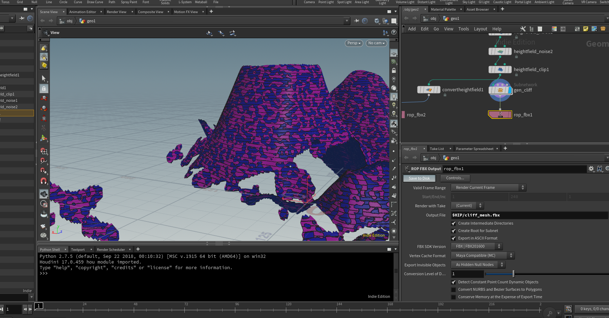|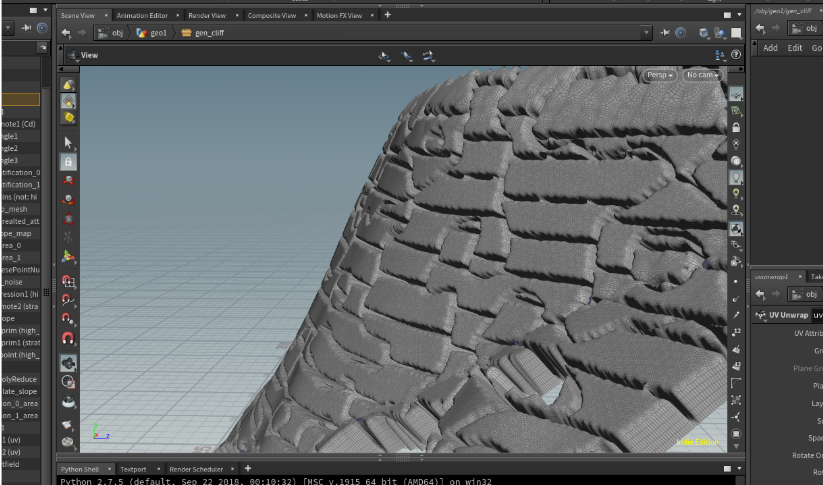|

### ID Map

|High Res|Low Res|
|-|-|
|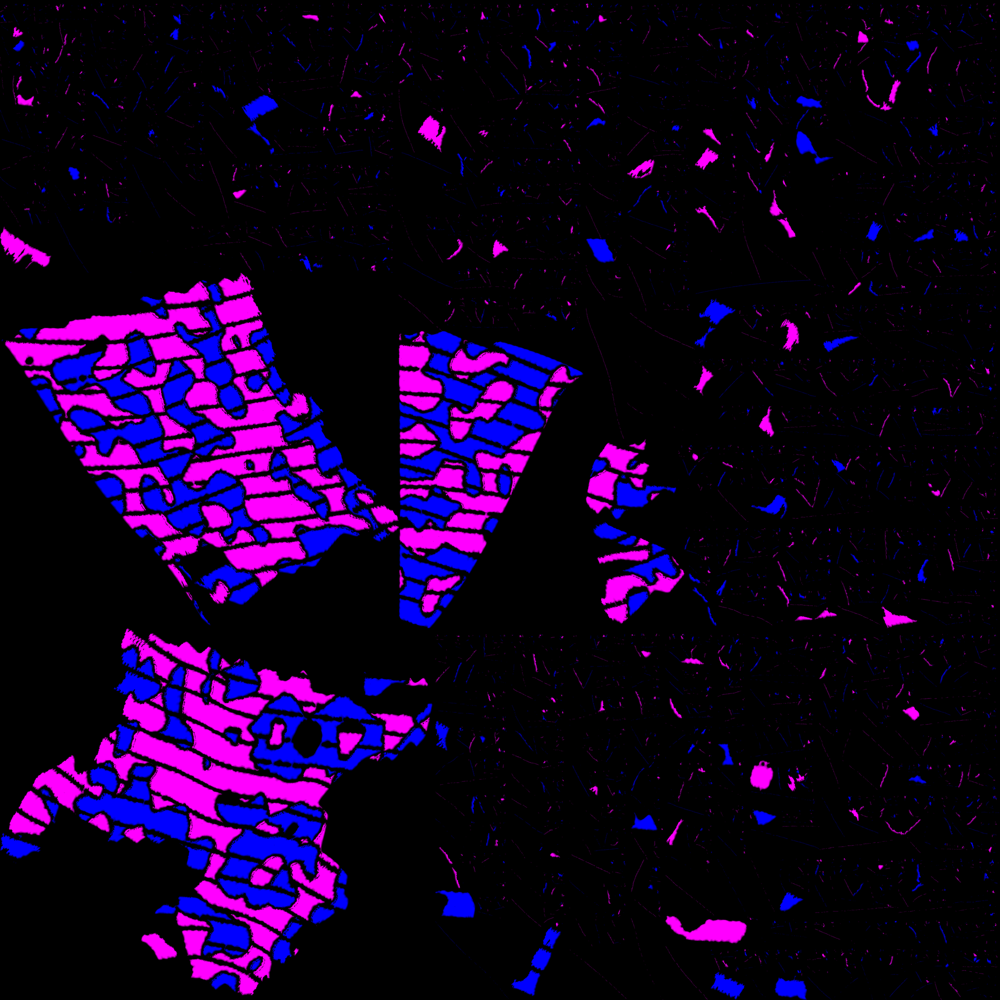|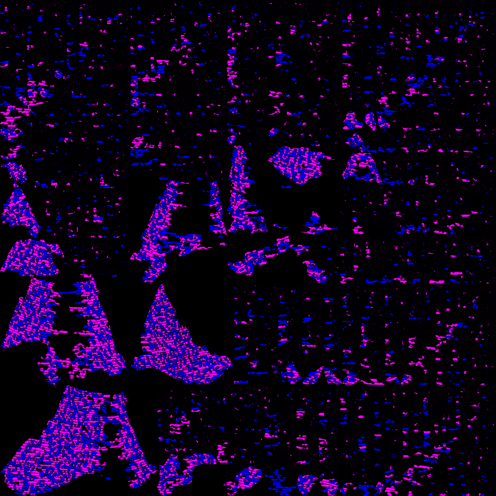|

### Slope

|High Res|Low Res|
|-|-|
|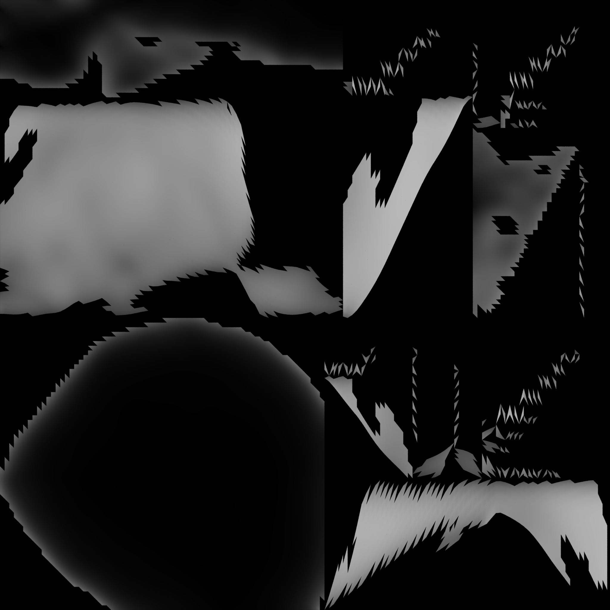|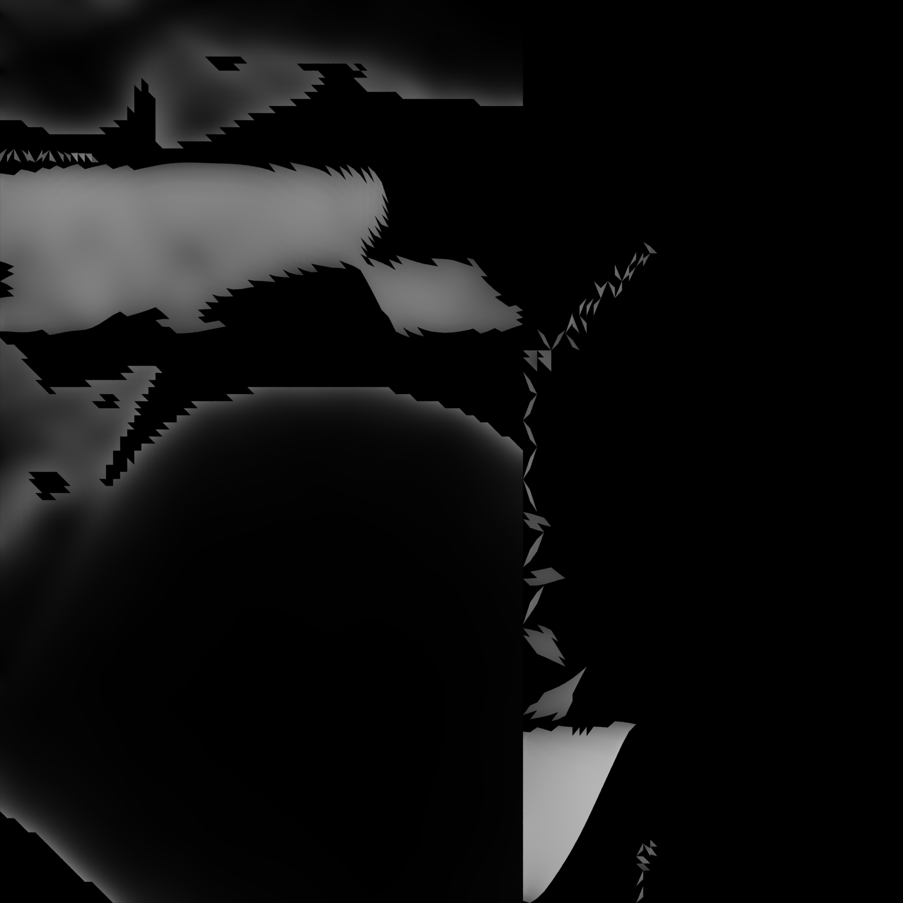|

## Technical Detail

The cliff generation procedure is based on Ubisoft's GDC talk. Only five steps: **Slope Thresholding, Preparing Geometry, Stratification, Split, Shape Construction** are seleted to implement.

### Slope Thresholding

Points with high slope are selected into a group. The threshold is ajustable.

### Preparing Geometry

High-slope-points-containing primitives are selected to be remeshed and subdivided.

|Remesh|Subdivision|
|-|-|
|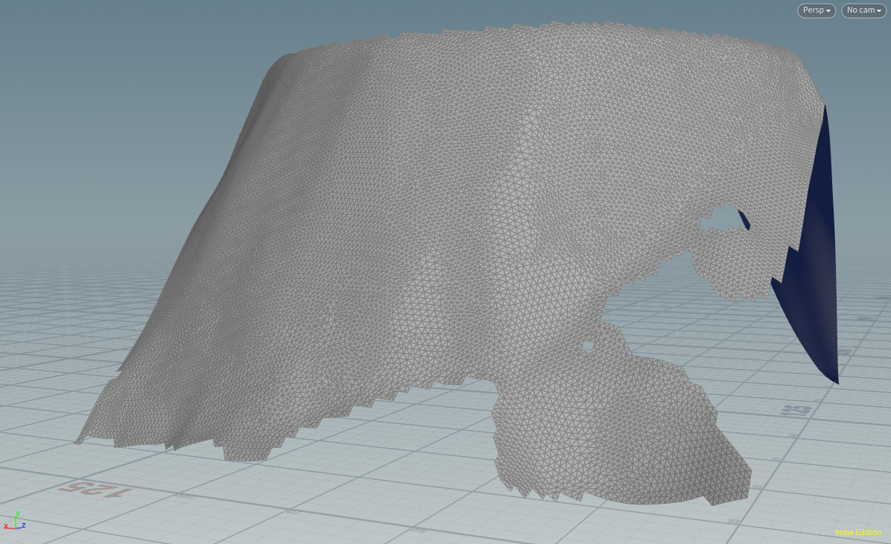|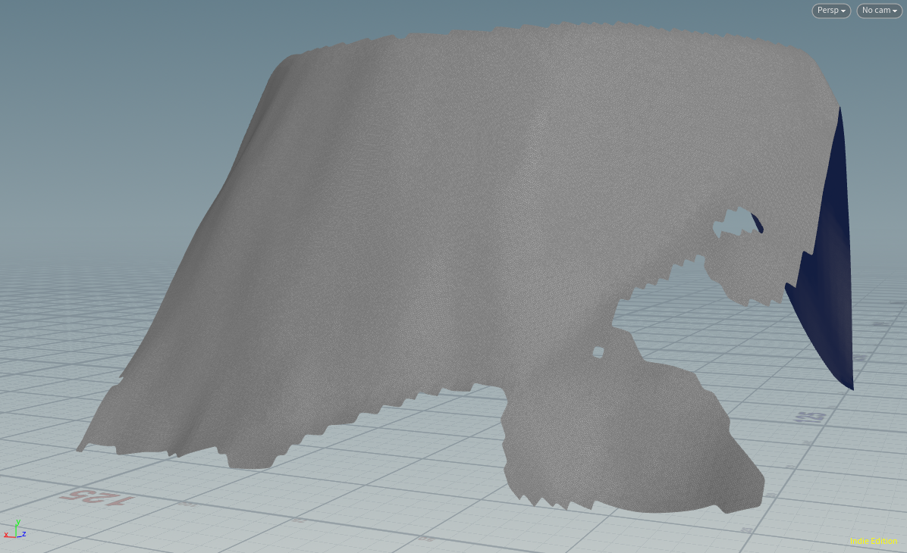|

### Stratification

Primitives after remeshing and subdivision are then converted to point selection. Those points are selected by this [VEX code](VEX/straticification).

The idea is to generate layered and separated boxes to server a the bounding volume in order to select points on cliff.

|Box|Points Selected|
|-|-|
|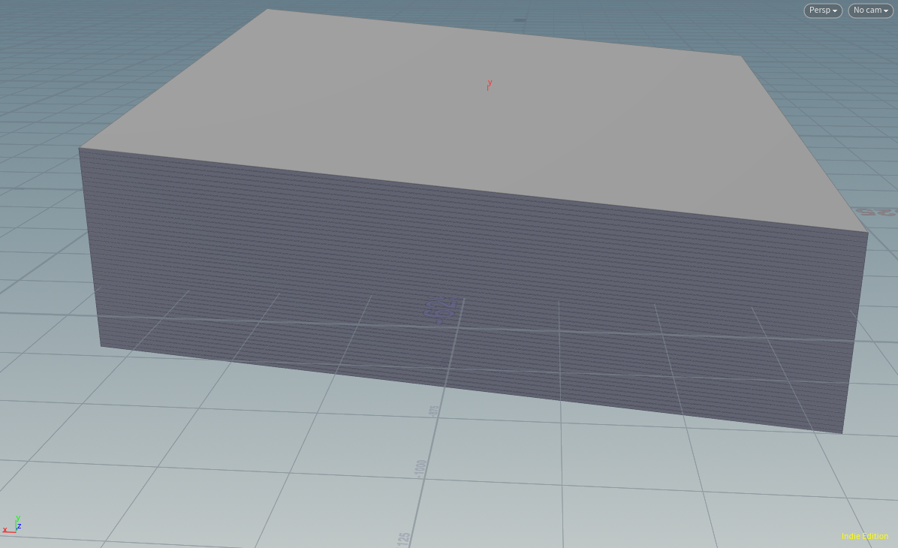|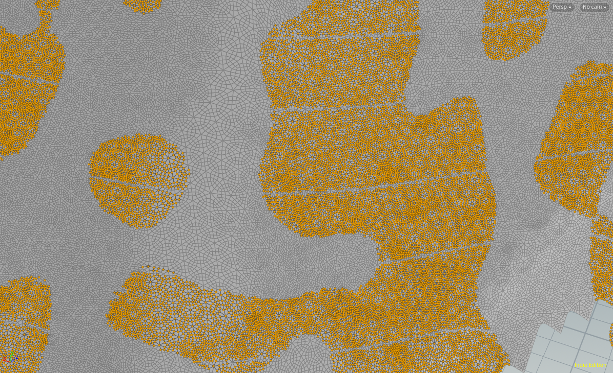|

### Split

Points with high slope is divided into two goups according to 3D Perlin noise.

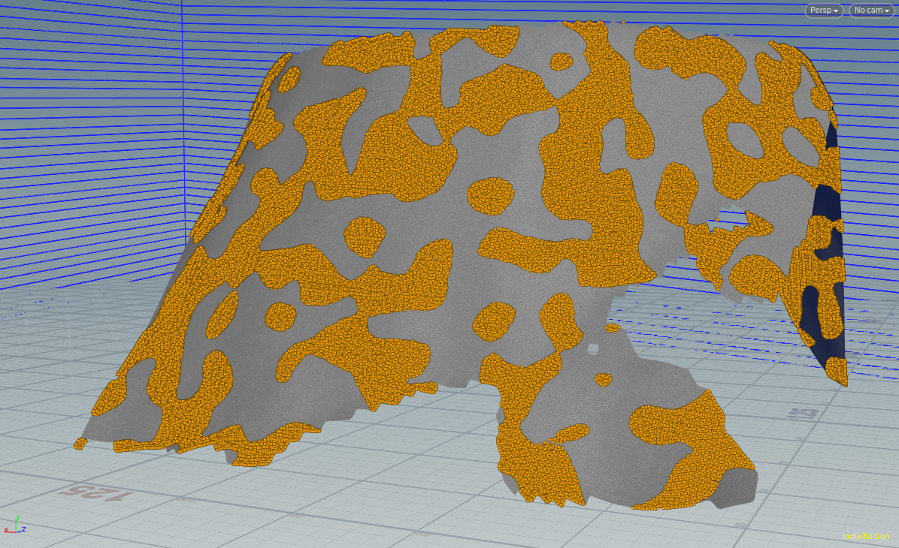

To have better orgnization, this step actually happens before the stratification step.

### Shape Construction

Shaper construction is extrusion + blur.

|Extrusion|Blur|
|-|-|
|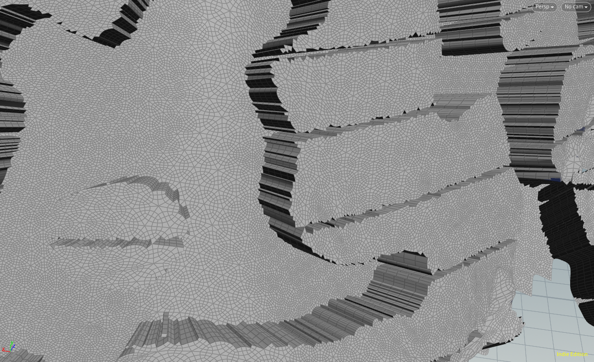|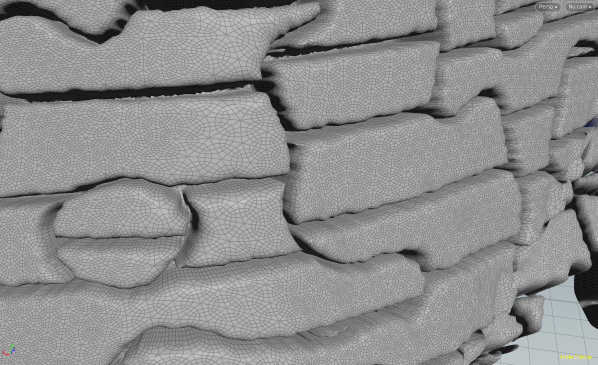|

## Usability

### Parameter Exposion

The cliff generation network is wrapped in a subnetwork. The adjustable parameters are exposed to the subnetwork leve.

|Subnetwork|Cliff Params|
|-|-|
|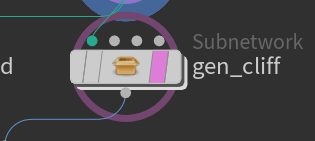|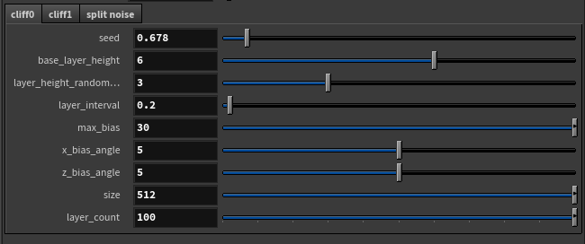|

|Split Params|Peram Linking|
|-|-|
|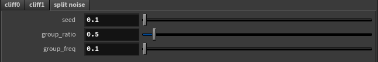|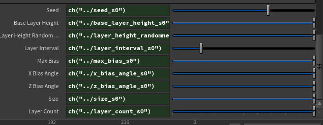|

### Height Field

Height field workflow is Houdini's most powerful terrain editing tool. The tool(as a subnetwork) takes a heightfield as an input.

|Height Field Input|
|-|
|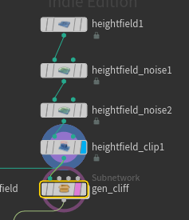|

### Output

ID map, heightfield map and cliff mesh are baked using separated nodes. 

## Credits

- [Ubisoft GDC Talk](https://www.youtube.com/watch?v=NfizT369g60)

- [Ubisoft GDC Talk PDF](https://twvideo01.ubm-us.net/o1/vault/gdc2018/presentations/ProceduralWorldGeneration.pdf)

- [Far Cry 5](https://en.wikipedia.org/wiki/Far_Cry_5)
